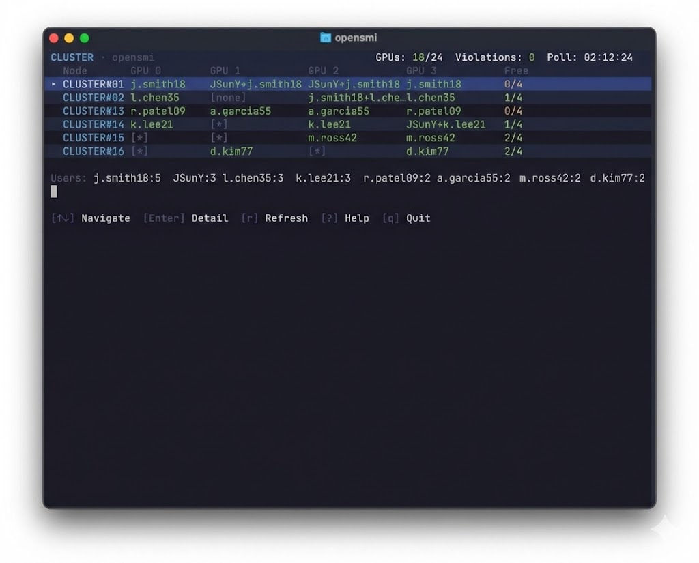
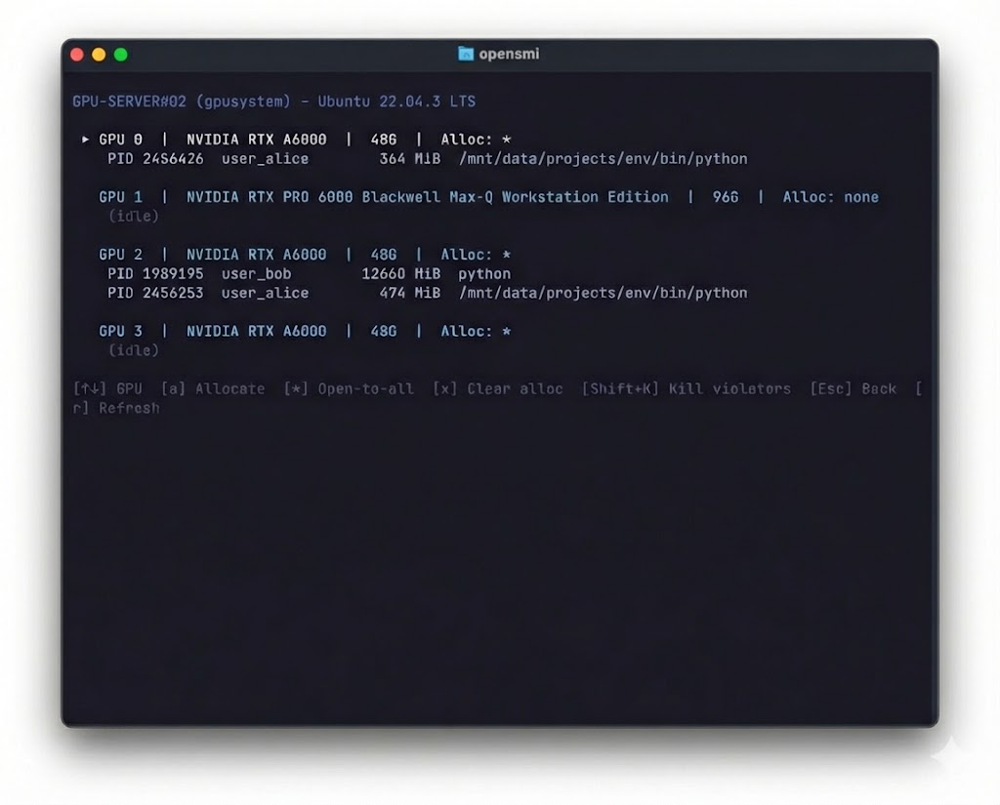
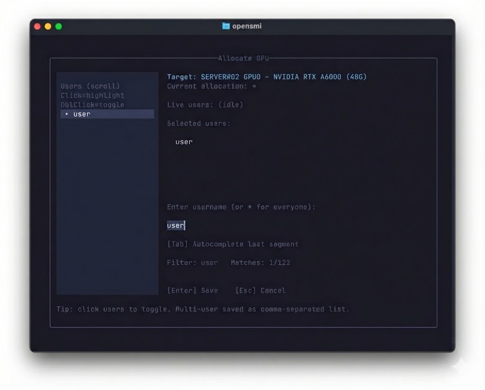

<p align="center">
  <h1 align="center">opensmi</h1>
  <p align="center">Agentless, multi-node GPU allocation manager (SSH + nvidia-smi only)</p>
  <p align="center">
    <a href="LICENSE"></a>
    
    
    
  </p>
</p>

<p align="center">
  <a href="README.kr.md">한국어</a>
</p>

<p align="center">
  
  
  
</p>
<p align="center"><sub><em>Screenshots are taken from a real environment; sensitive details (node names, usernames, file paths) have been redacted with Nano Banana.</em></sub></p>

---

`opensmi` helps teams monitor and enforce GPU allocations across a self-managed cluster **without installing anything on GPU nodes**.  
It runs from your terminal, connects over SSH, and reads `nvidia-smi`.

---

## What you get

- **Interactive TUI** — live dashboard, node detail, GPU runner, job tracker
- **CLI** — poll, allocate, detect violations, watch, kill, exec
- **Policy enforcement** — unallocated GPU usage is a violation; `*` = open to all
- **No agents or daemons** on GPU nodes
- **Python stdlib only** — zero pip dependencies for the CLI

---

## Install

Recommended — installs both CLI + TUI:

```bash
curl -fsSL https://raw.githubusercontent.com/seilk/opensmi/main/scripts/install.sh | bash
```

Binaries land in `~/.local/bin`. The installer auto-detects your shell (zsh/bash/fish) and prints the exact PATH line to add — or offers to add it for you when run interactively.

**Requirements:** macOS or Linux · Python 3.8+ · SSH access to GPU nodes with `nvidia-smi`

### Update

```bash
opensmi update
```

Replaces the CLI, TUI binary, and wrapper in one step. No uninstall needed.  
If you hit GitHub API rate limits: `export OPENSMI_GITHUB_TOKEN=<token>`

### Uninstall

```bash
opensmi uninstall             # remove CLI + TUI
opensmi uninstall --dry-run   # preview what would be removed
```

To also wipe state and config (irreversible):

```bash
opensmi uninstall --purge-state --yes
```

---

## Quick start

```bash
# 1. Create config (interactive wizard)
opensmi onboard

# 2. Verify SSH connectivity + GPU visibility
opensmi poll

# 3. Launch the TUI
opensmi
```

Config is written to `~/.opensmi/opensmi.json` by default.  
Override with `--config <path>` or `OPENSMI_CONFIG`.

---

## TUI

Launch with:

```bash
opensmi
```

The top bar shows: **cluster name · user@hostname · GPUs used/total · Violations · Poll time**

### Tab Navigation

Switch tabs with **`Ctrl+X T`** to open the tab switcher, then press the shortcut or use arrow keys.

| Shortcut | Tab | Description |
|----------|-----|-------------|
| `d` | Dashboard | Live GPU grid — who's using what, per node |
| `n` | Node Detail | Per-GPU memory, utilization, process list (enter from Dashboard via `Enter`) |
| `g` | My GPUs | Personal GPU view for the current operator |
| `j` | Jobs | Track queued, running, and finished jobs |
| `s` | Setup | Per-node env config (conda, venv, work dir) |
| `h` | Help | Keyboard shortcuts reference |

> **Note:** Node Detail is a hidden tab — navigate to it by selecting a node in the Dashboard and pressing `Enter`.  
> **Allocation management** (`a` allocate, `x` clear, `Shift+K` kill) is done directly from the Dashboard, not from a separate tab.

The **Command Runner** is a persistent pane at the bottom of the screen (not a tab). Focus it with `Ctrl+X ↓`.

**Global shortcuts (work from any tab):**

| Key | Action |
|-----|--------|
| `Ctrl+X T` | Open tab switcher |
| `Ctrl+X ↓` | Focus command runner pane |
| `Ctrl+X F` | Fold / unfold runner pane |
| `Ctrl+X Q` | Quit |

### Command Runner

The runner pane sits at the bottom of the TUI at all times. Focus it with `Ctrl+X ↓`, type a command, and execute with `Ctrl+X Enter`. Press `Esc` to unfocus.

**Execution modes** (`Tab` to toggle):
- `direct` — background process, output captured
- `tmux` — creates a tmux session you can attach to

**Distribution modes** (`Shift+Tab` to toggle):
- `single` — one command across multiple GPUs (`CUDA_VISIBLE_DEVICES=0,1,2`)
- `one-to-one` — different command per GPU (e.g., cross-validation folds)

**GPU assignment** (`g` to toggle):
- `auto` — ranks GPUs by idleness, last-used time, utilization
- `manual` — click GPUs in the panel to select

**Queue mode** (`q` to toggle):
- `immediate` — runs now
- `queued` — saves to job queue for auto-dispatch when GPUs free up

Preflight checks run before execution: tmux availability, command syntax, GPU availability.

### Jobs Tab

Tracks all submitted jobs (immediate and queued). From the detail view you can:
- View live output from tmux sessions
- Retry the last command on a session
- Cancel or delete a job record
- Clean up finished tmux sessions

---

## CLI Reference

```
opensmi poll                        # snapshot cluster GPU state
opensmi violations                  # list allocation violations (live)
opensmi alloc list                  # show all allocations
opensmi job list                    # list jobs
opensmi job list --status running   # filter by status
opensmi log                         # tail opensmi debug logs
opensmi log --follow                # live log stream
opensmi --help                      # full command list
```

All commands support `--json` for machine-readable output where applicable.

---

## Admin Features

> Admin actions require the operator to be listed in `opensmi.json` under `admins.master` or `admins.members`, and to have remote sudo-group membership on target nodes.

### Allocations

Allocations define which user is allowed on which GPU. Without an allocation, any GPU usage is a violation.

```bash
opensmi alloc list                        # show all allocations
opensmi alloc set GPU-01 0 alice          # assign GPU 0 on GPU-01 to alice
opensmi alloc set GPU-01 1 '*'            # open GPU 1 to everyone
opensmi alloc clear GPU-01 0              # remove allocation
opensmi alloc seed                        # auto-seed from live usage
opensmi alloc seed --force                # overwrite existing allocations
```

Special target `*` means any user is allowed on that GPU.

### Violations & Watch

```bash
opensmi violations                        # one-shot violation check (exit 1 if any)
opensmi watch                             # poll every 60s, print new violations
opensmi watch --interval 30               # custom poll interval (seconds)
opensmi watch --slack-webhook <url>       # send alerts to Slack
```

`violations` exits `0` (clean) or `1` (violations found) — suitable for CI/cron.

### Kill

Send a signal to remote PIDs:

```bash
opensmi kill GPU-01 <pid> [<pid> ...]
opensmi kill GPU-01 1234 5678 --signal KILL
opensmi kill GPU-01 1234 --no-sudo        # skip sudo, only own processes
```

Supported signals: `TERM` (default), `KILL`, `INT`, `HUP`.

### Remote Execution

```bash
# Run a command on a node with specific GPUs
opensmi exec GPU-01 --gpus 0,1 --command "python train.py"

# Use tmux mode for long-running jobs
opensmi exec GPU-01 --gpus 0 --command "python train.py" --mode tmux

# Submit to the job queue (auto-dispatches when GPUs free up)
opensmi job submit --auto-gpus 2 --command "python train.py"
```

### Node Env

Per-node environment configuration (conda/venv activation, working directory):

```bash
opensmi node-env GPU-01                                   # show current config
opensmi node-env GPU-01 --env-manager conda --env-name ml # set conda env
opensmi node-env GPU-01 --work-dir ~/projects             # set working dir
opensmi node-env GPU-01 --env-manager venv --env-name .venv
```

This config is used automatically when dispatching jobs to that node.

### Sudo Check

Verify that your SSH user has the required sudo-group membership on a node:

```bash
opensmi sudo-check GPU-01
opensmi sudo-check GPU-01 --json
```

### Admin Config

Admin identity and remote sudo-group requirements are set in `opensmi.json`:

```json
{
  "admins": {
    "master": "alice",
    "members": ["alice", "bob"],
    "remote_sudo_groups": ["sudo", "wheel"]
  }
}
```

- `master` / `members`: local usernames allowed to run admin commands
- `remote_sudo_groups`: SSH user must be in one of these groups on the target node for `alloc`, `kill`, and `exec` actions

---

## Configuration

Config is plain JSON. Start from the template:

```bash
opensmi onboard          # interactive wizard
opensmi init             # write default template
```

Reference template: [`opensmi.example.json`](opensmi.example.json)  
Keep your real `opensmi.json` private — it's gitignored by default.

**Key environment variables:**

| Variable | Purpose |
|----------|---------|
| `OPENSMI_CONFIG` | Override config path |
| `OPENSMI_STATE_DIR` | Override state directory (useful for NFS/shared home) |
| `OPENSMI_PYTHON` | Override Python interpreter |
| `OPENSMI_GITHUB_TOKEN` | GitHub token to avoid API rate limits during update |

---

## Scope / Supported Environments

opensmi is a **standalone alternative to Slurm**, not a supplement.  
Running alongside an active Slurm installation is **not supported** and causes conflicts:

- **`CUDA_VISIBLE_DEVICES`**: Slurm remaps GPU indices to 0-based; opensmi uses physical indices — they conflict.
- **Process lifecycle**: opensmi tmux sessions run outside Slurm cgroups, bypassing Slurm's resource accounting.

**Supported use case**: self-managed GPU clusters with no workload scheduler (Slurm, PBS, LSF, etc.).

**Local node**: If opensmi runs on a GPU node itself, SSH is bypassed automatically — no loopback connection needed.

---

## Security

`opensmi` can execute remote commands over SSH (including process signals).  
Treat the machine you run it on as an admin workstation.  
See [`SECURITY.md`](SECURITY.md).

---

## Docs

- Architecture: [`docs/ARCHITECTURE.md`](docs/ARCHITECTURE.md)
- Releasing: [`docs/RELEASING.md`](docs/RELEASING.md)
- Changelog: [`CHANGELOG.md`](CHANGELOG.md)

---

## License

MIT — see [`LICENSE`](LICENSE).
